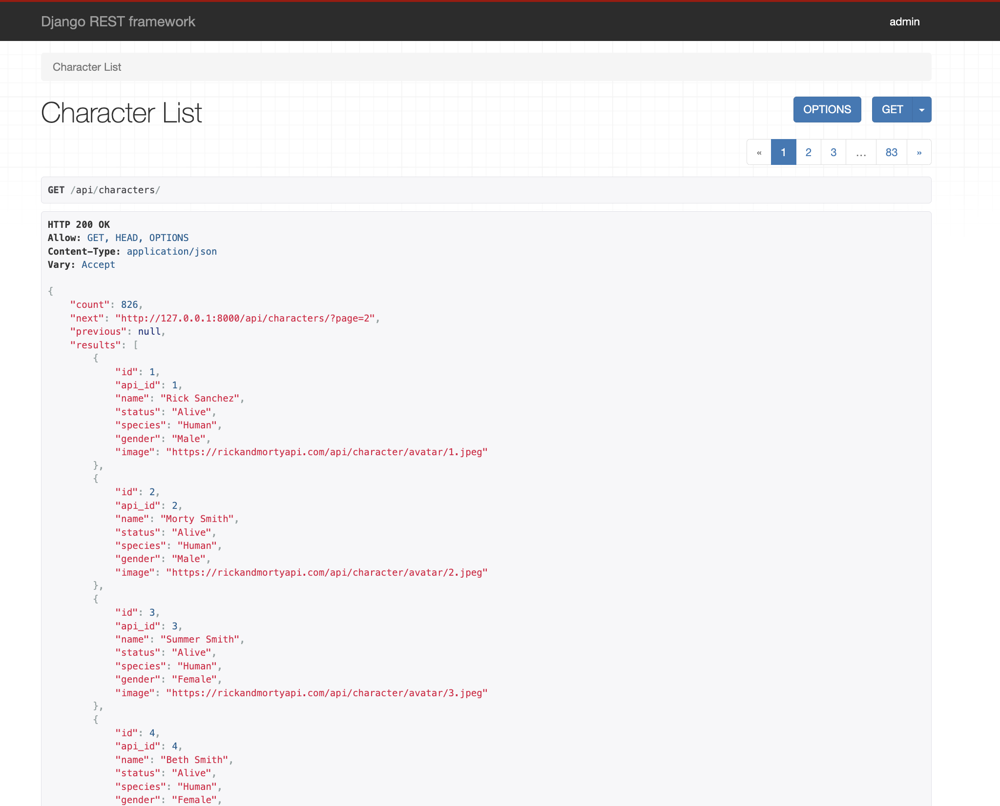
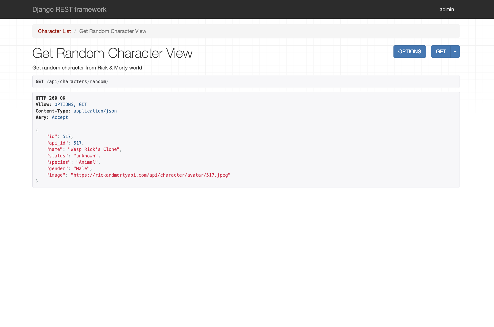
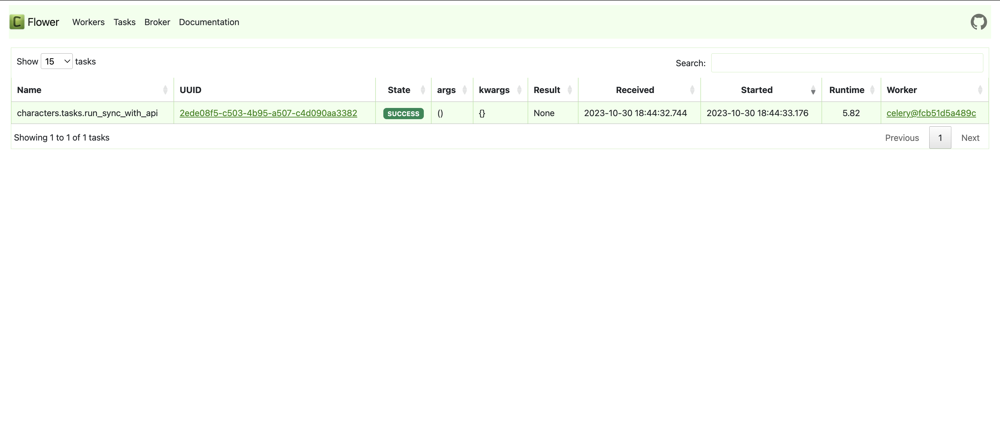
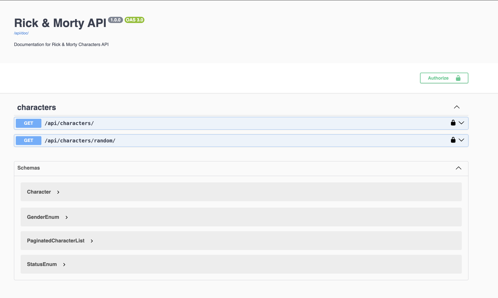

# Rick and Morty

> An application inspired by the animated series, Rick and Morty. This API service is built utilizing Python, Django,
> PostgreSQL, Celery, AsyncIO and other technologies. It handles a variety of operations including retrieving random
> characters, executing character searches, periodically synchronizing data with an external service, and persisting
> data
> in a local database amongst others.

## How to Use

### Docker Hub Installation

You can get the application image directly from Docker Hub:

[**Rick and Morty API on the Docker Hub**](https://hub.docker.com/repository/docker/oliuby/rick_and_morty_api)

Use the following command to pull the image:

```bash
docker pull oliuby/rick_and_morty_api
```

### Installation from GitHub

```bash
# Clone the repository
git clone https://github.com/olenaliuby/rick-and-morty

# Create a virtual environment and activate it
python -m venv venv
source venv/bin/activate

# Install necessary packages
pip install -r requirements.txt

# Set up environmental variables for Postgres and your secret key
POSTGRES_DB=<value>
POSTGRES_USER=<value>
POSTGRES_PASSWORD=<value>
POSTGRES_HOST=<value>
POSTGRES_PORT=<value>
SECRET_KEY=<value>
CELERY_BROKER_URL=<value>
CELERY_RESULT_BACKEND=<value>

# Apply migrations and start the server
python manage.py migrate
python manage.py runserver
```

### Execution with Docker

To build and run the application with Docker, use the following commands:

```bash
docker-compose build
docker-compose up
```

These commands will build and start all the services defined in docker-compose.yml file, respectively.

### Demo:




